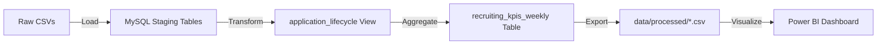
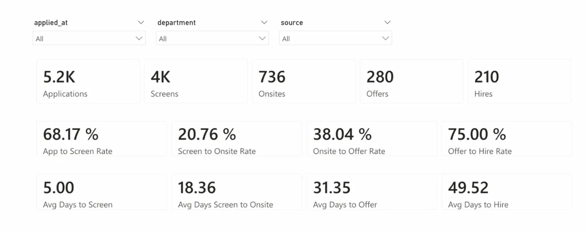
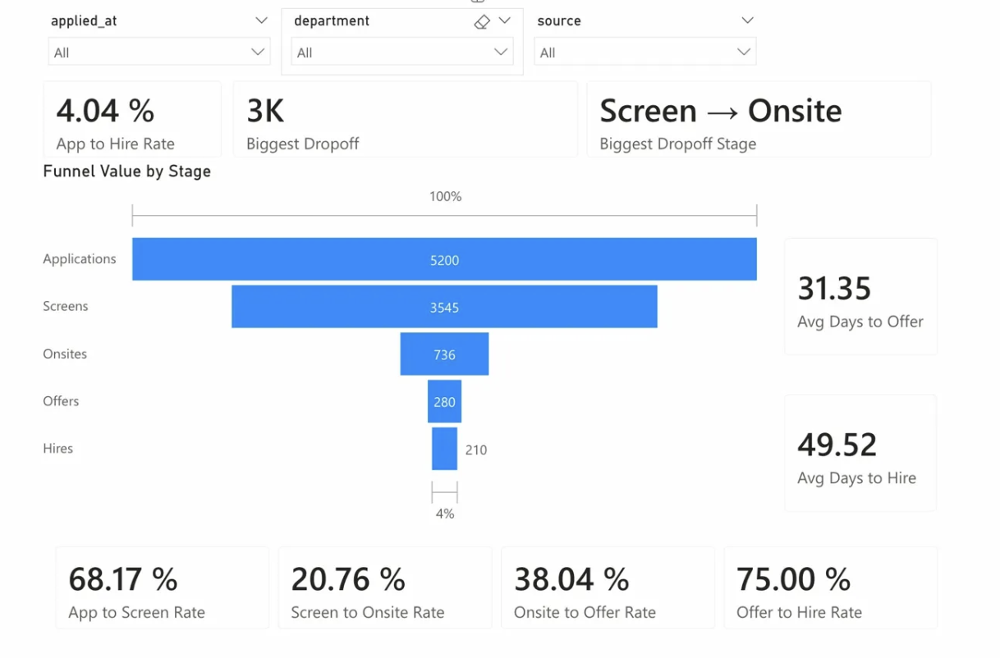
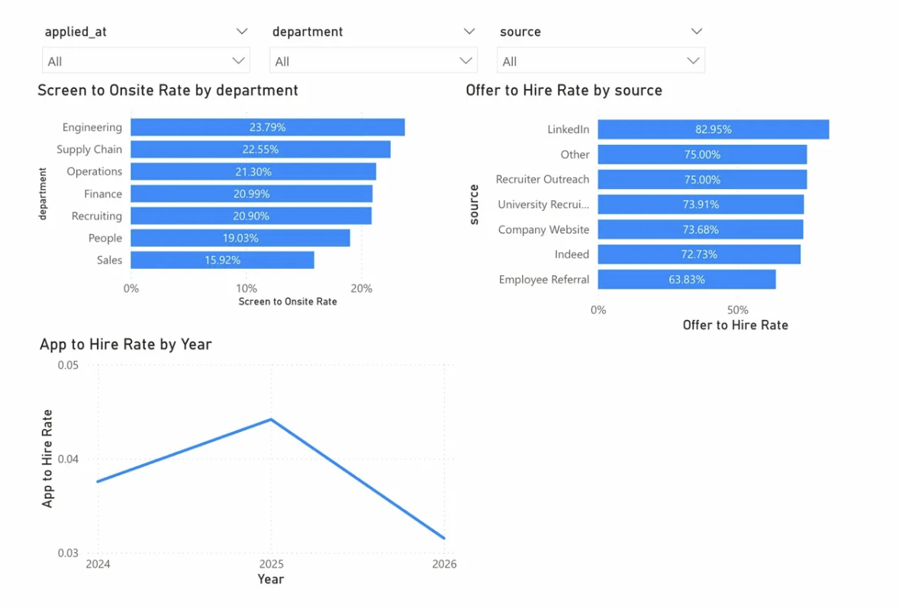

# Recruiting Funnel & People Analytics

## Project Goal: A Product-Centric Recruiting Data System
**Optimize Hiring Velocity & conversion through rigorous data engineering.**
This project builds a **production-grade recruiting analytics product** to solve a critical business problem: **High time-to-hire and opaque funnel drop-offs.**

Aligned with Tesla's **"Product-Centric"** philosophy for internal tools, this repo demonstrates:
1. **Discoverability**: User-friendly documentation for non-technical stakeholders.
2. **Trustworthiness**: Rigorous automated testing ("Data Quality as Code").
3. **Scalability**: A normalized schema designed for high-volume ATS event streams.

---

## Tech Stack & Method
- **SQL (MySQL)**: Advanced relational modeling, CTEs, and window functions.
- **Data Engineering**: "ELT" pattern — loading raw data, validating integrity, then transforming into a reporting layer.
- **Data Quality**: Automated test suite detecting duplicates, orphans, and logic violations (e.g., *Hired without Offer*).

---

## Dataset
Synthetic ATS-style data across 6 interrelated tables:

| Table | Rows | Description |
|---|---|---|
| candidates | 3,200 | One row per candidate |
| requisitions | 180 | One row per job requisition |
| applications | 5,212 | One row per application (incl. 12 intentional duplicates) |
| stage_events | 16,896 | One row per stage event per application |
| offers | 280 | One row per offer extended |
| hires | 210 | One row per hire |

**Pipeline:** Applied → Screen → Phone Interview → Onsite → Offer → Hired / Rejected / Withdrawn

**Intentional data quality cases built in for testing:**
- 12 duplicate application rows
- 5 orphan stage events (missing parent application)
- 2 out-of-order offer events (offer before onsite)

---

## Project Structure
```
recruiting-funnel-analytics/
├── data/
│   └── raw/                              # Synthetic ATS data (Applications, Stage Events, Offers)
├── sql/
│   ├── 00_create_tables.sql              # Normalized Schema (Star Schema design)
│   ├── 01_load_data.sql                  # Load scripts handling ISO8601 parsing
│   ├── 02_data_exploration.sql           # Base grain verification
│   ├── 03_relationship_sanity_checks.sql # Cardinality & Orphan detection
│   ├── 04_data_quality_tests.sql         # Logic validation (Crucial for Trust)
│   ├── 05_reporting_layer.sql            # 'application_lifecycle' view & 'kpis_weekly'
│   ├── 06_analysis_queries.sql           # Strategic insights (Source quality, Velocity)
│   └── 07_validation_queries.sql         # KPI reconciliation & metric trust checks
├── docs/
│   ├── DATA_DICTIONARY.md                # Field definitions and table relationships
│   ├── kpi_definitions.md                # Standardized metric formulas
│   ├── assumptions_and_notes.md          # Join rules, grain decisions, limitations
│   ├── executive_summary.md              # One-page insights for non-technical stakeholders
│   ├── system_gap_analysis.md            # Root cause analysis of 4 upstream ATS data gaps
│   └── process_improvement_proposal.md   # Concrete ATS config changes to fix gaps at source
└── README.md
```

---

## Data Lineage (ETL Pipeline)
The architecture follows a strict "Raw → Silver → Gold" progression to ensure traceability:



1. **Raw**: Ingested "as-is" from ATS dumps (handling ISO8601 dates).
2. **Staging**: Normalized tables with relaxed constraints for dirty loading.
3. **Silver (Lifecycle)**: Pivoted event logs into candidate-journey rows.
4. **Gold (KPIs)**: Aggregated metrics ready for executive consumption.

---

## Key Technical Components

### 1. Reporting Layer (`sql/05_reporting_layer.sql`)
Instead of messy ad-hoc queries, I built a reliable `application_lifecycle` view:
- **Pivots** row-based event logs into a candidate-centric view using a 4-table JOIN + CTE + `ROW_NUMBER()` window function
- **Deduplicates** raw applications before they reach the reporting layer
- **Isolates** business logic (e.g., handling "Withdrawn" vs "Rejected")
- **Enables** safe regular reporting via `recruiting_kpis_weekly`

### 2. Data Quality Suite (`sql/04_data_quality_tests.sql`)
Trust is paramount. 9 automated tests validate:
- **Referential Integrity**: No "ghost" offers without applications
- **Stage Logic**: No "Offer" timestamps occurring *before* "Onsite"
- **Uniqueness**: Detects 12 intentional duplicate applications in the raw stream
- **Process Violations**: Hired without Offer, negative durations, null timestamps

### 3. Upstream System Gap Analysis (`docs/system_gap_analysis.md`)
Goes beyond SQL to identify 4 structural ATS weaknesses with root causes and mitigations:
- Duplicate applications — missing unique constraint on `(candidate_email, req_id)`
- Orphan stage events — asynchronous logging failure at the webhook/event stream layer
- Hired without offer — recruiters bypassing offer approval workflow
- Timestamp issues — local browser time captured instead of UTC server time

### 4. Process Improvement Proposal (`docs/process_improvement_proposal.md`)
4 concrete ATS configuration changes to fix gaps at the source:
- Enforce unique application constraints in the ATS backend
- Mandatory workflow rules to prevent stage skipping
- Automated Slack SLA alerts for Hiring Managers (target: -15% time-to-hire)
- DocuSign integration to capture `offered_at` timestamps systematically

---

## Key Findings

| Metric | Value |
|---|---|
| Total Applications | 5,212 |
| Total Hires | 210 |
| Overall Hire Rate | ~4% |
| Offer Acceptance Rate | 75% |
| Avg Time-to-Hire | ~49.5 days |
| Primary Funnel Bottleneck | Applied → Screen (79.3% drop-off) |
| Duplicate Applications Detected | 12 (4% of total) |
| Orphan Stage Events | 5 (3% anomaly rate) |

---

## Business Impact & Systems Thinking
*Why this matters to the Head of People:*
- **OAR Monitoring**: If Offer Acceptance Rate drops from 75% to 60%, this system detects it immediately via `recruiting_kpis_weekly`, enabling investigation of comp band competitiveness or recruiter closing skills.
- **Velocity Bottlenecks**: If Time-to-Hire increases by 15%, the granularity of `application_lifecycle` pinpoints exactly which stage is dragging — indicating a process bottleneck rather than a market issue.
- **Recruiter Performance**: Conversion rates attributed per recruiter surface high-performers and those needing support.

---

## CI/CD & Automation (Next Steps)
To move from "Project" to "Production Platform":
1. **Automated Testing**: Integrate `sql/04_data_quality_tests.sql` into a CI pipeline (GitHub Actions/dbt). Verification runs on every PR.
2. **Orchestration**: Schedule `01_load_data.sql` and `05_reporting_layer.sql` via Airflow DAGs to run daily at 6 AM UTC.
3. **Alerting**: Validations in `sql/07_validation_queries.sql` trigger Slack alerts if variance > 1% (data drift detection).

---

## How to Run
1. **Initialize DB**: `source sql/00_create_tables.sql`
2. **Ingest Data**: `source sql/01_load_data.sql`
   *(Handles ISO8601 date parsing)*
3. **Verify Integrity**: `source sql/04_data_quality_tests.sql`
   *(Should return 0 rows for Pass, except where intentional duplicates are detected)*
4. **Build Marts**: `source sql/05_reporting_layer.sql`

---

## Power BI Dashboard

### Page 1 — KPI Summary


### Page 2 — Funnel Analysis


### Page 3 — Source & Department Breakdown


---

*Built by Harthik Mallichetty · [LinkedIn](https://www.linkedin.com/in/harthikrm/) · MSBA @ UT Dallas*
